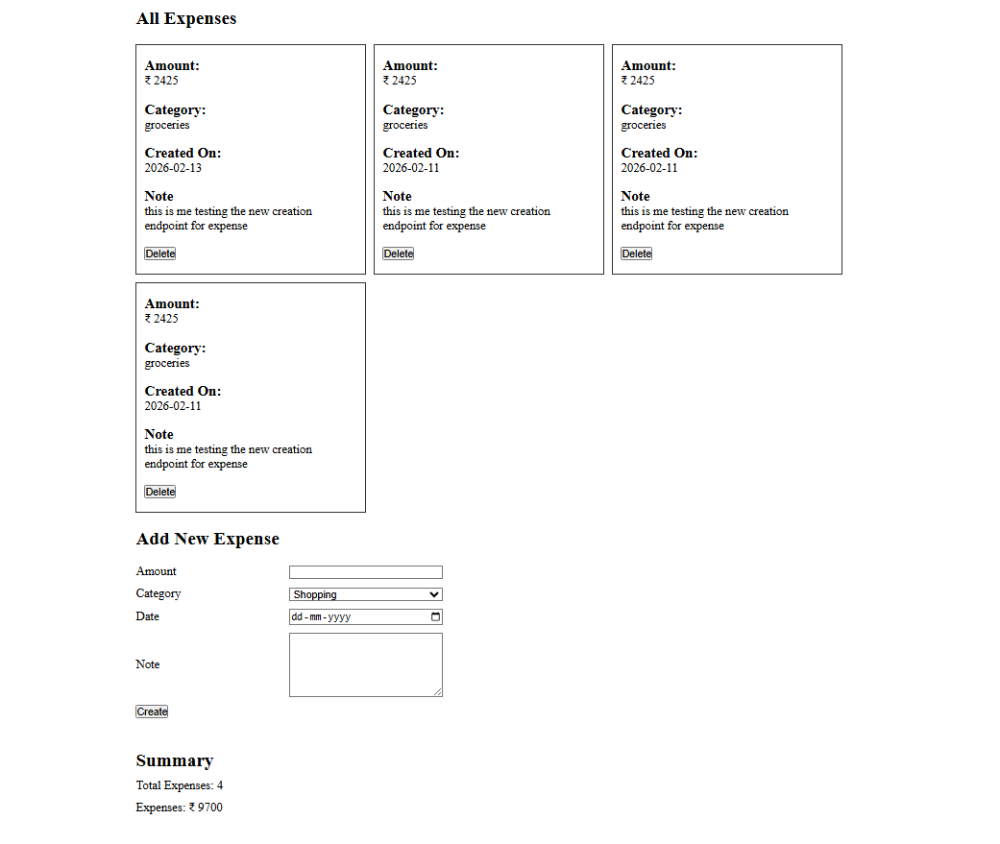
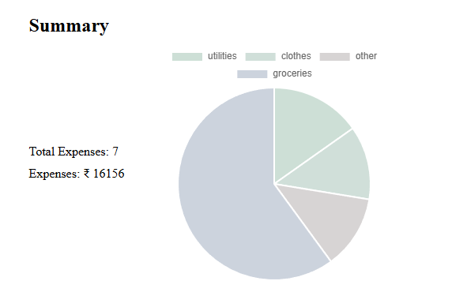

# An expense tracker MVP
**Description:** The continuation of my MERN based expense tracker app, this is complete v2

**Current Features:**
* User can create expense
* User can delete expense
* User can see all expenses in card format
* User can see a summary of number of expenses made and how much totak expense add upto
* User can see a category based chart using react-charts-js-2

**How to run:** 
To run first start server using `npm run server` and then start client using `npm run client` both from root of the folder.

Screenshot:

CHART ADDED - 